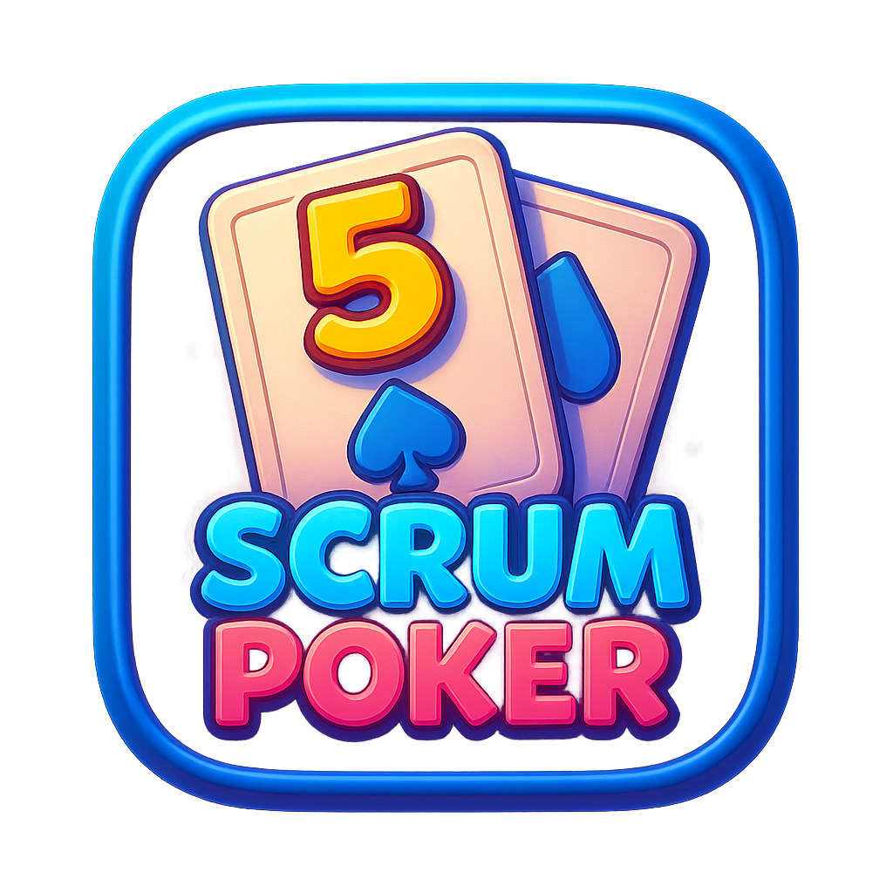

<p align="center">
  
</p>

<h1 align="center">🃏 Scrum Poker</h1>

<p align="center">
  A lightweight, no-fuss scrum poker app for agile teams.<br/>
  Built with Go + Vue 3 — served as a single binary.
</p>

---

## ✨ Features

- 🎯 **One-click room creation** — rooms get fun auto-generated names
- 🗳️ **Real-time voting** — powered by Server-Sent Events (SSE)
- 👥 **Player tracking** — see who has voted at a glance
- 🔄 **Reveal & reset** — control the flow of each estimation round
- 🌗 **Light / Dark / Auto theme** — respects your system preference
- 📋 **Copy room link** — easily share the room URL with your team
- 🧹 **Auto-cleanup** — inactive rooms and players are removed automatically
- 💾 **Optional persistence** — save rooms to a JSON file across restarts
- 📦 **Single binary** — UI is embedded via Go's `embed` package

## 🛠️ Tech Stack

| Layer    | Technology                                                        |
| -------- | ----------------------------------------------------------------- |
| Backend  | 🐹 [Go](https://go.dev) with [Echo v5](https://echo.labstack.com) |
| Frontend | 💚 [Vue 3](https://vuejs.org) + [Vite](https://vite.dev)          |
| Realtime | 📡 Server-Sent Events (SSE)                                       |
| Styling  | 🎨 Bootstrap                                                      |

## 🚀 Getting Started

### Prerequisites

- 🐹 Go 1.25+
- 📗 Node.js 20.19+ or 22.12+
- 📦 [pnpm](https://pnpm.io)

### 🏗️ Build & Run

Build the frontend and backend in one step:

```bash
./build.sh
./scrumpoker
```

The app will be available at **http://localhost:1323** 🎉

### ⚙️ Configuration

| Flag             | Env Var        | Default  | Description                        |
| ---------------- | -------------- | -------- | ---------------------------------- |
| `--bind`, `-b`   | `BIND`         | `:1323`  | Address to bind the server         |
| `--persist-file`, `-pf` | `PERSIST_FILE` | —        | File path to persist rooms as JSON |

**Example:**

```bash
./scrumpoker --bind :8080 --persist-file rooms.json
```

## 🧑‍💻 Development

For a smooth dev experience, use [modd](https://github.com/cortesi/modd) for live-reloading the Go backend:

```bash
modd
```

For the frontend dev server with hot-reload:

```bash
cd ui
pnpm dev
```

## 📁 Project Structure

```
├── cmd/scrumpoker/       🚀 Server entrypoint & middleware
├── pkg/
│   ├── errresp/          ❌ Error response helpers
│   └── handler/
│       ├── health/       💓 Health check endpoint
│       └── rooms/        🏠 Room & voting logic (SSE, CRUD)
├── ui/                   💚 Vue 3 frontend (embedded at build time)
│   └── src/
│       ├── components/   🧩 Reusable Vue components
│       ├── composables/  🪝 Vue composables
│       ├── services/     🔌 API client
│       ├── views/        📄 Page views
│       └── router/       🗺️ Vue Router config
├── go.mod                📋 Go module definition
├── build.sh              🏗️ Full build script (UI + backend)
└── modd.conf             🔁 Live-reload config
```

## 📡 API Overview

All endpoints are under `/api/v1`.

| Method | Endpoint               | Description          |
| ------ | ---------------------- | -------------------- |
| `POST` | `/rooms/`              | Create a new room    |
| `GET`  | `/rooms/:id/`          | Get room details     |
| `POST` | `/rooms/:id/join`      | Join a room          |
| `POST` | `/rooms/:id/vote`      | Submit a vote        |
| `POST` | `/rooms/:id/reveal`    | Reveal all cards     |
| `POST` | `/rooms/:id/reset`     | Reset the round      |
| `GET`  | `/rooms/sse?stream=:id`| SSE event stream     |
| `GET`  | `/health/`             | Health check         |

## 📜 License

This project is licensed under the **MIT License** — see [LICENSE.md](LICENSE.md) for details.
